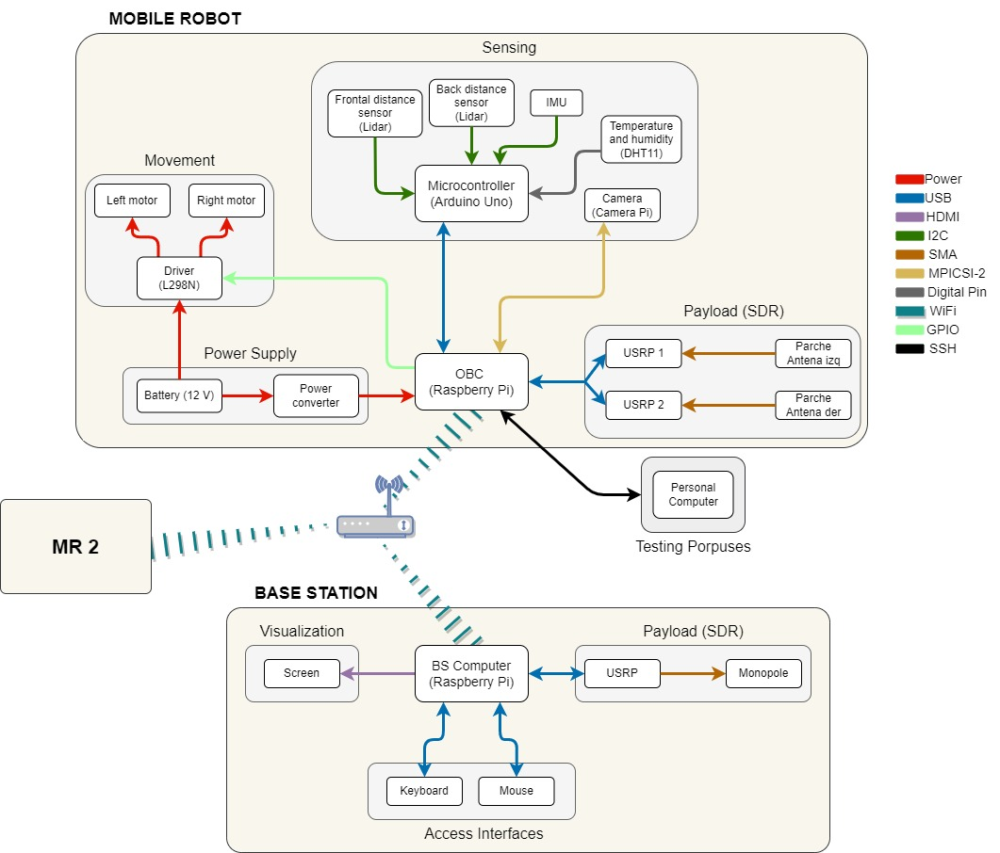

# **UncertanTIC**

## **Directory organization**

This is the main folder for the MobileRobot (MR). It contains the following files and folders:

- /**Assets** : Contains differnent immages for the GUI.

- /**GNURadio** : Contains all files related to GNU Radio development. Both .grc and .py files are included for editting the GNU flowchart and executing the program respectively.

- /**IoT_Hub** : Contains the script to run to send data and connect to azure IoT hub. Also contains a folder containing logs for the received data from the MR.

- *main.py* : main script to be executed in order to run the BS GUI.

## **Python**

### **Version**

> python version used -> 3.7

### **Libraries**

- random
- paho-mqtt
- picamera
- time
- os
- RPi.GPIO
- serial
- numpy
- datetime
- threading
- statistics
- tkinter

## **GNU Radio**

> GNU Radio version used -> 3.8.2.0

## **Interfaces**

## **Product Tree**

## **Graphic User Interface**

