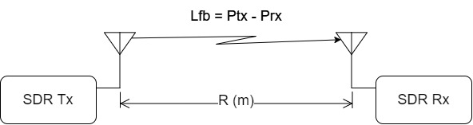
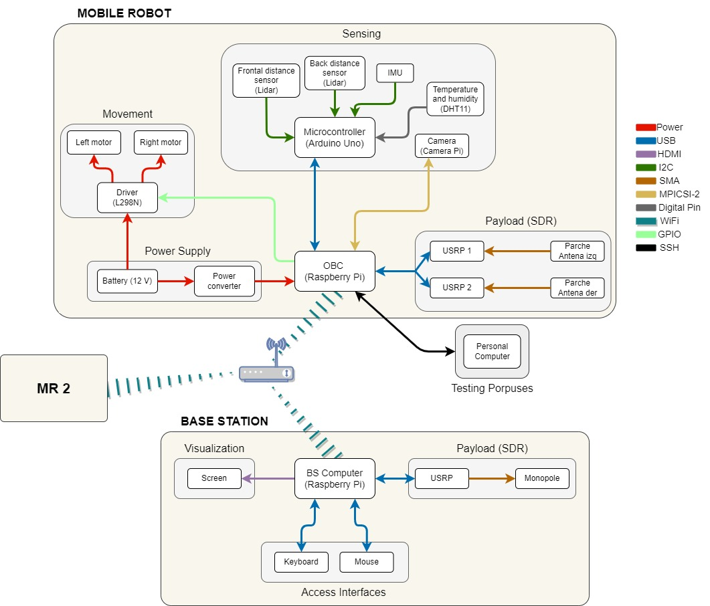
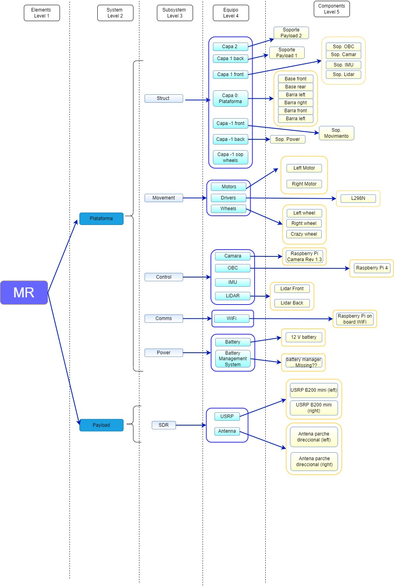

# **UncertainTIC**

## **Directory organization**

This is the main folder for the MobileRobot (MR). It contains the following files and folders:

- /**GNURadio** : Contains all files related to GNU Radio development. Both .grc and .py files are included for editting the GNU flowchart and executing the program respectively.
- /**Housekeeping** : Contains all the log files generated by the MR regarding all the sensing data with timestamps.

- /**Media**: Contains different folders with are organized in terms of different media files generated from the MR camera Pi. Contains pictures and videos.

- *main.py* : main script to be executed in order to run the MR.

## **Python**

### **Version**

> python version used -> 3.7

### **Libraries**

- random
- paho-mqtt
- picamera
- time
- os
- RPi.GPIO
- serial
- numpy
- datetime
- threading
- statistics

## **GNU Radio**

> GNU Radio version used -> 3.8.2.0

### **Theoretical concept**

## **Interfaces**

## **Product Tree**

