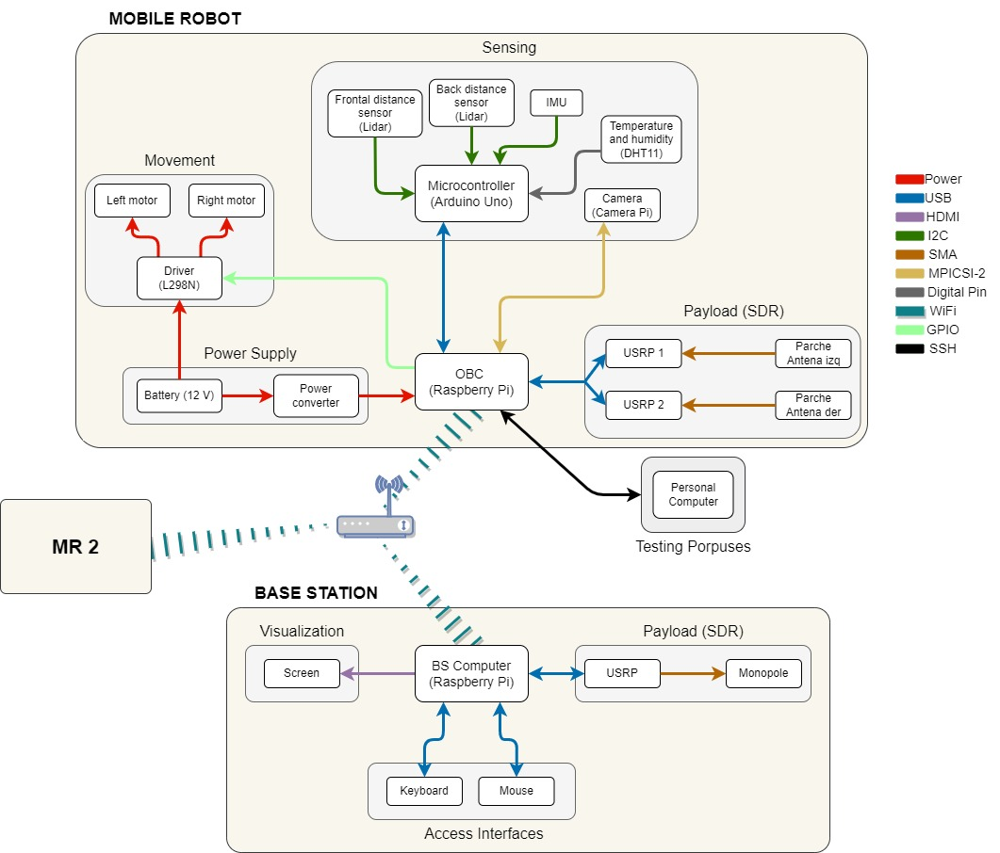

# **UncertainTIC**

## **Directories**

- /**BaseStation** : Contains all folders, scripts and documentation for the Base Station (BS).

- /**MobileRobot** : Contains all folders, scripts and documentation for the Mobile Robot (MR).

## **Python**

### **Version**

> python version used -> 3.7

### **Libraries**

- random
- paho-mqtt
- picamera
- time
- os
- RPi.GPIO
- serial
- numpy
- datetime
- threading
- statistics
- tkinter

## **GNU Radio**

> GNU Radio version used -> 3.8.2.0

## **Interfaces**

